# Android アプリの画面

Android アプリの画面と、その移り方です。画面そのものは Windows アプリと共通で(`web/`)、各タブの内容は [Windows アプリの画面](screens-windows.md) と同じです。ここでは、Android での見え方と、Windows との違いをまとめます。

画像は、Pixel 8a で本体に BLE で接続して撮ったものです(`mise run android-screenshot`。上端のステータスバーは切り落としています)。端末がダークテーマなので、暗い配色になっています。Wi-Fi の SSID と IP アドレスはモザイクにしています。

## Windows アプリとの違い

| | Android | Windows |
|---|---|---|
| 接続の方法 | BLE だけ(選ぶ欄は出ません) | USB と Bluetooth から選ぶ |
| 起動したとき | 前回の本体に自動でつなぎ直す | 未接続の画面から始まる |
| ペアリングの番号の入力 | Android の画面(OS)が出る | アプリの中に入力画面が出る |
| ログファイルのダウンロード | なし(ボタンが出ません) | USB で接続しているときに使える |
| アプリを閉じている間 | 接続を保つ(通知が出ます) | 接続は切れる |
| 配置 | 縦1列。下にスクロールして読む | 横に並ぶ |

## 画面遷移

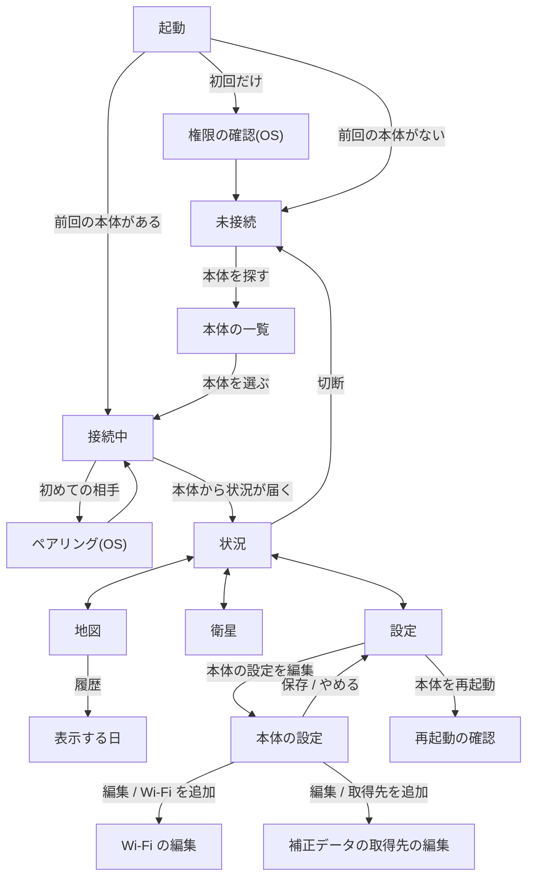

- 状況、地図、衛星、設定は、下端のタブで行き来します。タブは、接続している間だけ出ます。
- 右上の `切断` は、どのタブからでも押せます。`切断` を押すと未接続の画面に戻り、自動ではつなぎ直しません。
- 本体の画面(Setup → Bluetooth → Disconnect)から切断されたときも、未接続の画面に戻ります。

## 起動と接続

| 画面 | 内容と操作 |
|---|---|
| 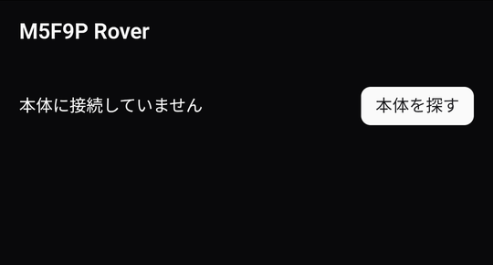 | **未接続** 接続する本体がないとき(初めて使うとき、`切断` を押したあと)に出ます。`本体を探す` を押すと、近くの本体を探します。 |
| 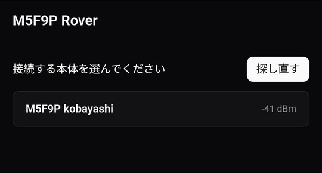 | **本体の一覧** 見つかった本体が、電波の強さ(dBm)と一緒に並びます。本体を押すと接続します。ほかの端末(Windows アプリなど)が接続している本体は、`ほかの端末が接続中` と出て、選べません。 |
| 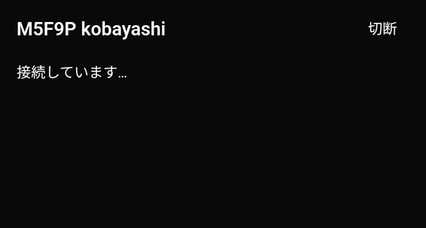 | **接続中** 「接続しています…」、続いて「本体からの状況を待っています…」と出ます。状況が届くと、「状況」のタブに移ります。 |

次の画面は Android(OS)が出すもので、画像は載せていません。

- **権限の確認**: 初めて起動したときに、「付近のデバイス」(Bluetooth での検索と接続)と、通知の許可を求められます。許可しないと、本体を探せません。位置情報の権限は使いません。
- **ペアリング**: 初めての本体に接続すると、本体の画面に6桁の番号が出て、Android のペアリングの画面が出ます。番号を入力すると、接続が続きます。一度ペアリングすれば、次からは出ません。
- **通知**: 接続している間、「本体に接続しています」という通知が出ます。アプリを閉じても接続は保たれ、通知を押すとアプリが開きます。

## 状況

| | |
|---|---|
| 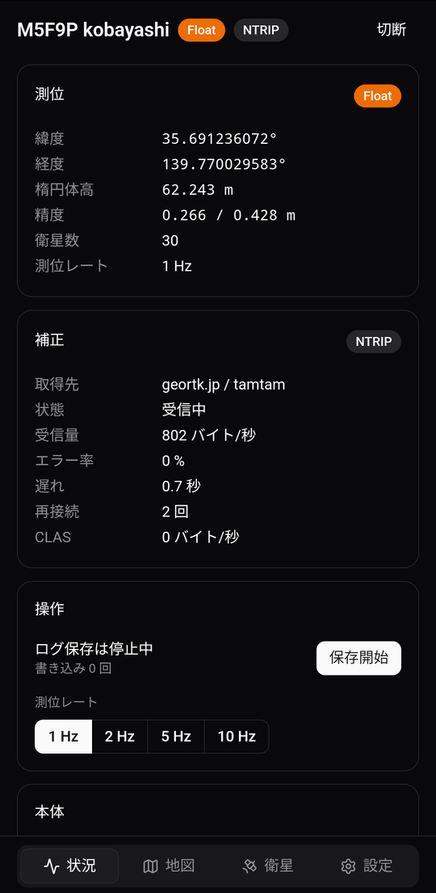 | 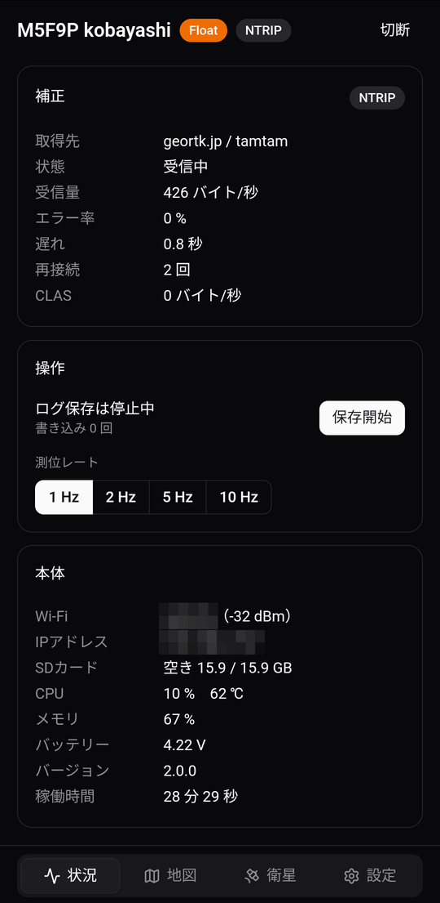 |

上端に、受信機名、測位の状態、補正の方法、`切断` が出ます。その下に、測位、補正、操作、本体の枠が縦に並びます(右の画像は、下にスクロールしたところ)。

操作の枠には、`保存開始` / `保存停止`(ログの保存)と、測位レートの切り替えがあります。`ログファイル…` のボタンは、Android にはありません。

## 地図

| | |
|---|---|
| 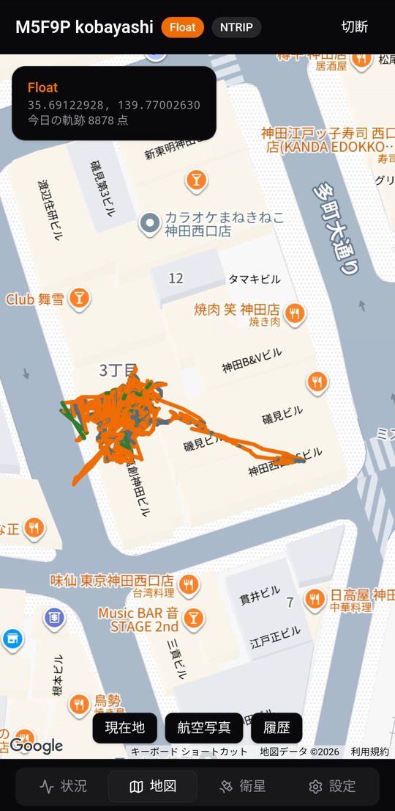 | 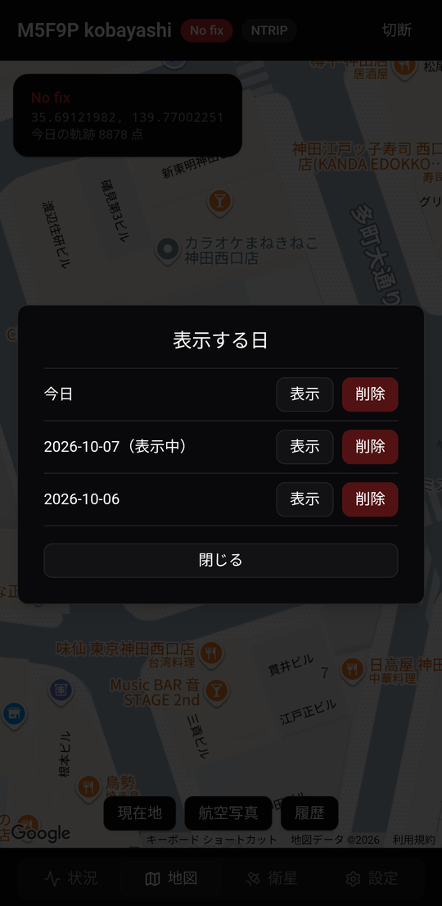 |

現在地と、軌跡を表示します。`現在地`(地図を動かしたあとに出ます)、`航空写真` / `地図`、`履歴` のボタンがあります。

`履歴` を押すと、「表示する日」が開きます(右の画像)。`表示` でその日の軌跡を地図に出し、`削除` でその日の軌跡を消します。`閉じる` で地図に戻ります。

## 衛星

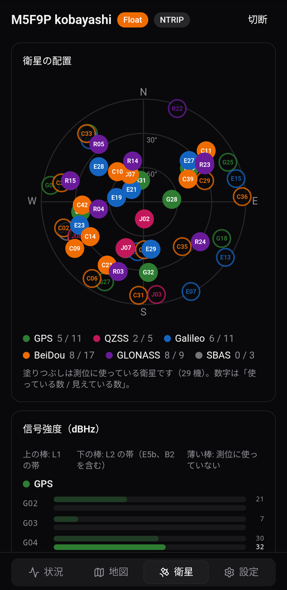

衛星の配置(スカイプロット)の下に、衛星ごとの信号強度が続きます。表示だけで、ほかの画面には移りません。

## 設定

| | |
|---|---|
| 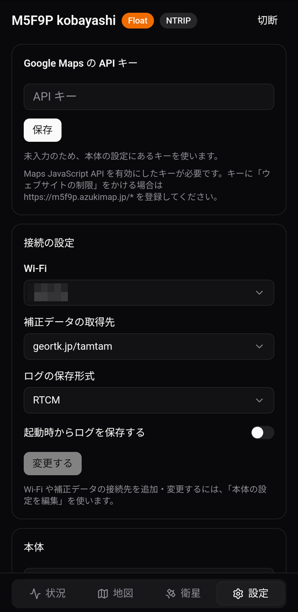 | 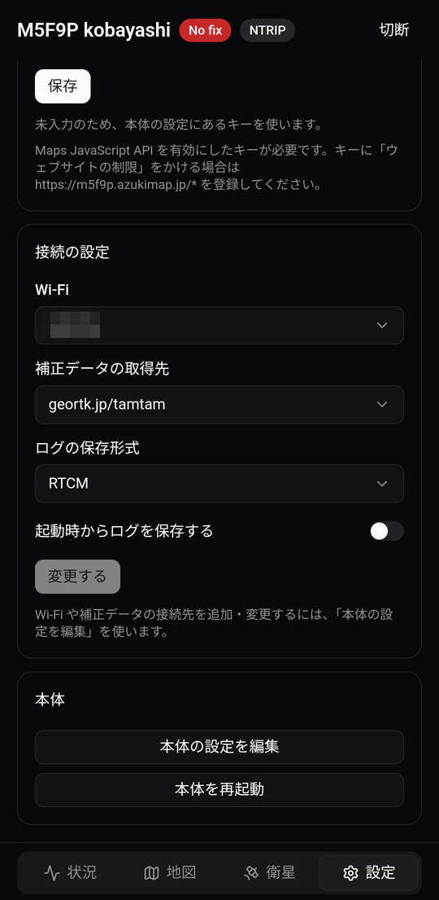 |

Google Maps の API キー、接続の設定(使う Wi-Fi、補正データの取得先、ログの保存形式、起動時からログを保存するかどうか)、本体(`本体の設定を編集`、`本体を再起動`)の枠が縦に並びます。

`変更する` は、本体にすぐ反映します。`本体を再起動` を押すと確認が出て、`実行` で再起動します。

### 本体の設定

| | |
|---|---|
| 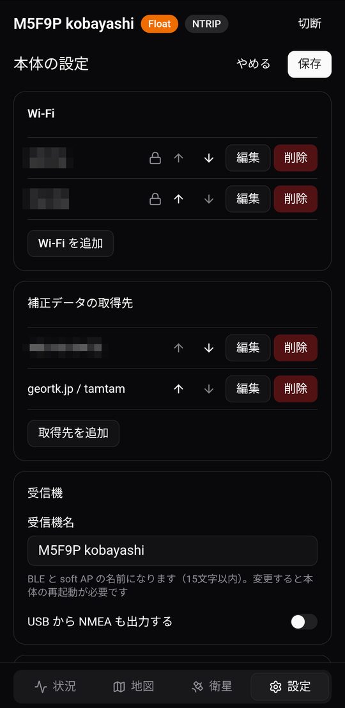 | 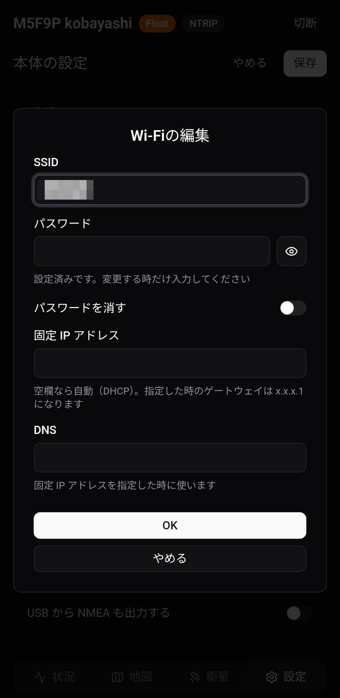 |

`本体の設定を編集` を押すと、設定のタブの中身が、本体の設定ファイルの編集画面に替わります(左の画像)。項目と操作は Windows アプリと同じです([Windows アプリの画面](screens-windows.md#本体の設定))。

一覧の `編集` を押すと、その項目の編集画面が開きます(右の画像は Wi-Fi)。`OK` で一覧に反映し、`やめる` で閉じます。本体に書き込むのは、上の `保存` を押したときです。`やめる` で設定のタブに戻ります。
