# Android アプリの画面

Android アプリの画面と、その移り方です。画面そのものは Windows アプリと共通で(`web/`)、各タブの内容は [Windows アプリの画面](screens-windows.md) と同じです。ここでは、Android での見え方と、Windows との違いをまとめます。

画像は、Pixel 8a で本体に BLE で接続して撮ったものです(`mise run android-screenshot`。上端のステータスバーは切り落としています)。端末がダークテーマなので、暗い配色になっています。Wi-Fi の SSID と IP アドレスはモザイクにしています。

## Windows アプリとの違い

| | Android | Windows |
|---|---|---|
| 接続の方法 | BLE だけ(選ぶ欄は出ません) | USB と Bluetooth から選ぶ |
| 起動したとき | 前回の本体に自動でつなぎ直す | 未接続の画面から始まる |
| ペアリングの番号の確認 | Android の画面(OS)が出る | アプリの中に確認の画面が出る |
| ログファイルのダウンロード | なし(ボタンが出ません) | USB で接続しているときに使える |
| アプリを閉じている間 | 接続を保つ(通知が出ます) | 接続は切れる |
| 配置 | 縦1列。下にスクロールして読む | 横に並ぶ |

## 画面遷移

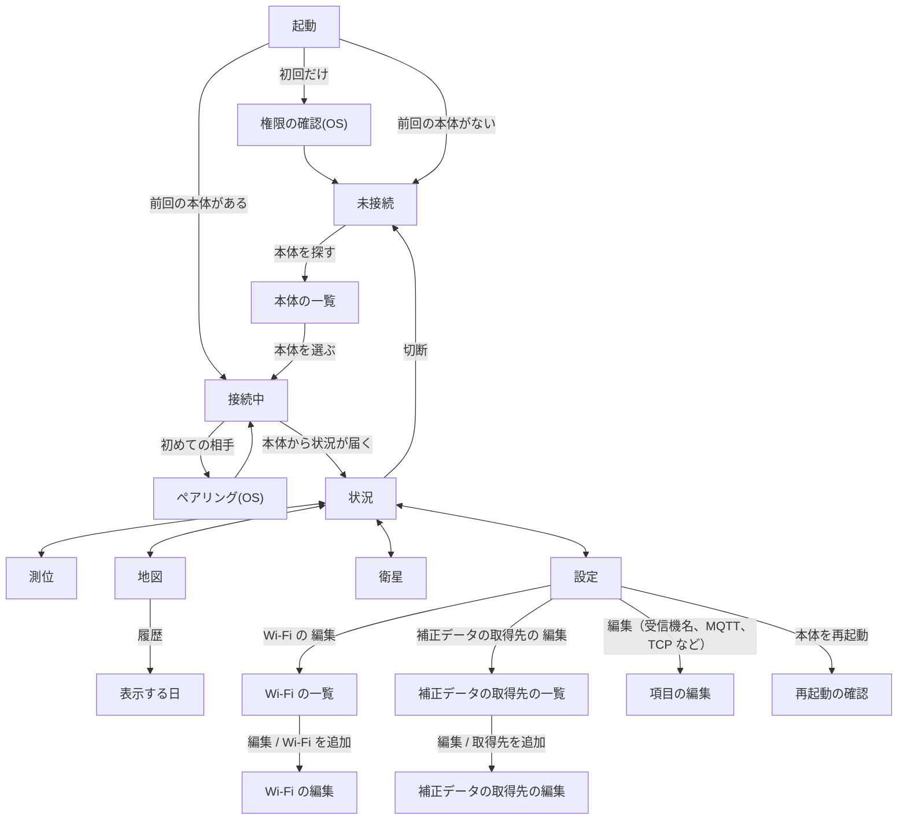
```mermaid
flowchart TD
    Launch["起動"] -- "初回だけ" --> Perm["権限の確認(OS)"]
    Perm --> Start["未接続"]
    Launch -- "前回の本体がある" --> Connecting["接続中"]
    Launch -- "前回の本体がない" --> Start

    Start -- "本体を探す" --> List["本体の一覧"]
    List -- "本体を選ぶ" --> Connecting
    Connecting -- "初めての相手" --> Pair["ペアリング(OS)"]
    Pair --> Connecting
    Connecting -- "本体から状況が届く" --> Status["状況"]

    Status <--> Live["測位"]
    Status <--> Map["地図"]
    Status <--> Sats["衛星"]
    Status <--> Settings["設定"]

    Map -- "履歴" --> Days["表示する日"]
    Settings -- "Wi-Fi の 編集" --> WifiList["Wi-Fi の一覧"]
    WifiList -- "編集 / Wi-Fi を追加" --> WifiEdit["Wi-Fi の編集"]
    Settings -- "補正データの取得先の 編集" --> SourceList["補正データの取得先の一覧"]
    SourceList -- "編集 / 取得先を追加" --> SourceEdit["補正データの取得先の編集"]
    Settings -- "編集（受信機名、MQTT、TCP など）" --> GroupEdit["項目の編集"]
    Settings -- "本体を再起動" --> Restart["再起動の確認"]

    Status -- "切断" --> Start
```

- 測位、状況、地図、衛星、設定は、下端のタブで行き来します。タブは、接続している間だけ出ます。
- 右上の `切断` は、どのタブからでも押せます。`切断` を押すと未接続の画面に戻り、自動ではつなぎ直しません。
- 本体の画面(Setup → Bluetooth → Disconnect)から切断されたときも、未接続の画面に戻ります。

## 起動と接続

| 画面 | 内容と操作 |
|---|---|
| 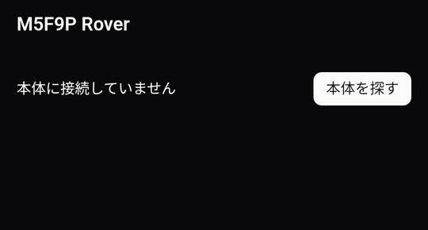 | **未接続** 接続する本体がないとき(初めて使うとき、`切断` を押したあと)に出ます。`本体を探す` を押すと、近くの本体を探します。 |
| 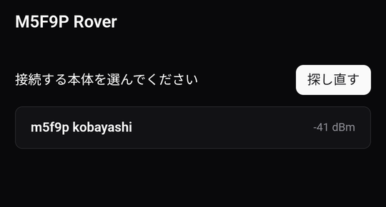 | **本体の一覧** 見つかった本体が、電波の強さ(dBm)と一緒に並びます。本体を押すと接続します。ほかの端末(Windows アプリなど)が接続している本体は、`ほかの端末が接続中` と出て、選べません。 |
| 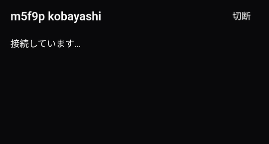 | **接続中** 「接続しています…」、続いて「本体からの状況を待っています…」と出ます。状況が届くと、「状況」のタブに移ります。 |

次の画面は Android(OS)が出すもので、画像は載せていません。

- **権限の確認**: 初めて起動したときに、「付近のデバイス」(Bluetooth での検索と接続)と、通知の許可を求められます。許可しないと、本体を探せません。位置情報の権限は使いません。
- **ペアリング**: 初めての本体に接続すると、本体の画面と Android の両方に同じ6桁の番号が出ます。Android の画面で「ペア設定」を押し、本体の画面でも `Same` を押すと、接続が続きます。一度ペアリングすれば、次からは出ません。
- **通知**: 接続している間、「本体に接続しています」という通知が出ます。アプリを閉じても接続は保たれ、通知を押すとアプリが開きます。

## 測位

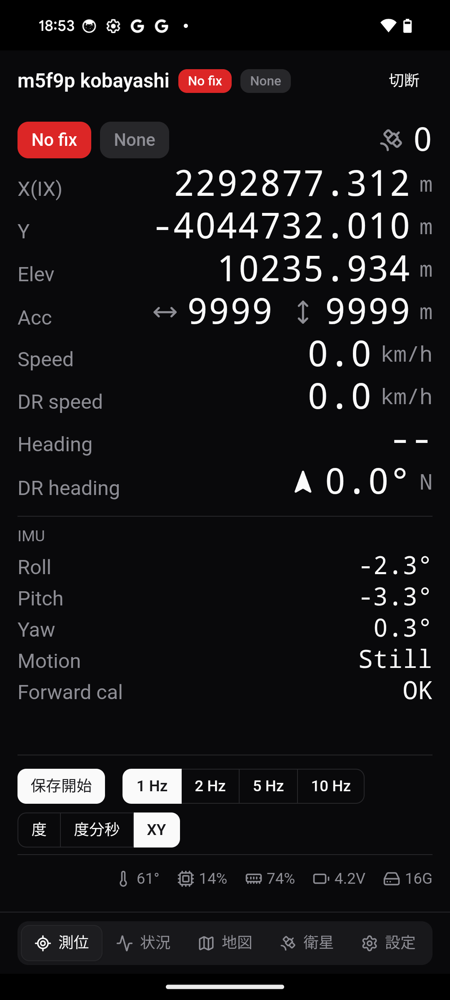

本体の画面の Status と同じ項目を、大きな文字で表示します。屋外で端末を表示器として見るときに使います。見出しは本体の画面と同じく英語で、1行に見出しと値(右寄せ)を並べます。

- 上段: 測位の状態と補正の方法のバッジ、ログの保存中の `REC`(点滅する赤い丸)、衛星数
- `Lat`、`Lon`: 緯度、経度。下段の「座標の形」で `度分秒` にすると度分秒(`35°41'28.50705"N`)、`XY` にすると `X(IX)`、`Y`(平面直角座標、m。系は設定タブで選ぶ)に替わります
- `Elev` / `Alt`: 標高。設定の「標高を表示する」を切ったときと、ジオイド高が届かないときは楕円体高(`Alt`)
- `Acc`: 精度(左右の矢印が水平、上下の矢印が垂直。m)
- `Speed`、`DR speed`、`Heading`、`DR heading`: 速度(km/h)と方角(進行方向の角度と16方位、進行方向に向けた矢印)。止まっている間(1 km/h 未満)は、方角を `--` にします。`DR` の付いた行は IMU の推測航法の値で、GNSS の値のすぐ下に並べます(IMU を使うときだけ)。
- 下段: 操作。`ログ`(`保存開始` / `保存停止`。保存中は形式を表示)、`測位レート`(1 / 2 / 5 / 10 Hz)、`座標の形`(`度` / `度分秒` / `XY`)の 3 行。変えるとすぐに本体に反映されます
- 最下段: 本体の状態(CPU 温度、CPU 使用率、メモリ使用率、電圧、SD カードの空き)

このタブを開いている間は、画面が自動で消えません。ほかのタブに移るか切断すると、元に戻ります。

## 状況

| | |
|---|---|
| 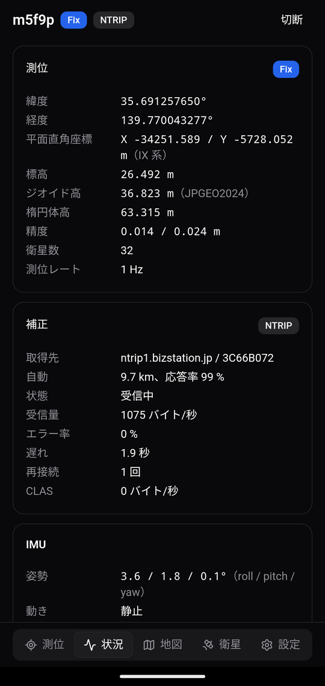 | 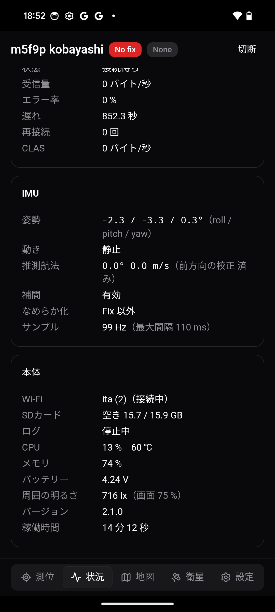 |

上端に、受信機名、測位の状態、補正の方法、`切断` が出ます。その下に、測位、補正、本体の枠が縦に並びます(右の画像は、下にスクロールしたところ)。

ログの保存の開始・停止と測位レートの切り替えは、測位タブで行います。本体の枠のログの行は、保存中かどうかと書き込み回数の表示だけです。`ログファイル…` のボタンは、Android にはありません。

## 地図

| | |
|---|---|
| 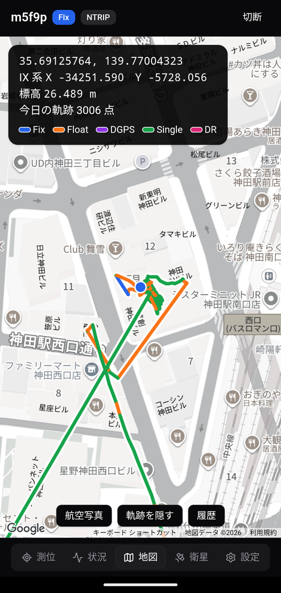 | 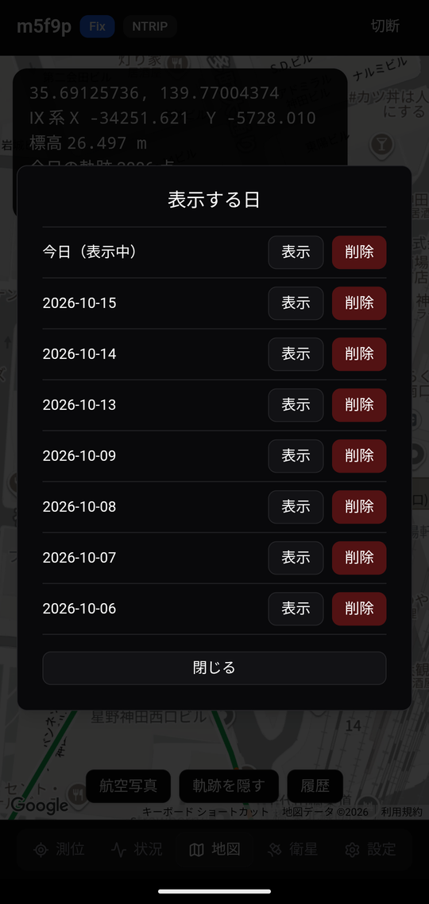 |

現在地と、軌跡を表示します。左上に、座標(系を選んでいれば平面直角座標の X、Y も)、標高(ジオイドモデルがないときは楕円体高)、軌跡の点数が出ます(地図の上で読みやすいよう、黒地に白い文字)。この表示はタップすると閉じ、左上の i のボタンで開き直せます(選んだ状態は次回も同じ)。`現在地`(地図を動かしたあとに出ます)、`航空写真` / `地図`、`軌跡を隠す` / `軌跡を表示`(軌跡の表示の入・切。選んだ状態は次回も同じ)、`履歴` のボタンがあります。地図は、軌跡と現在地の色が見分けやすいよう、彩度を抑えた配色で表示します。軌跡と現在地の点は、測位の状態で色を分けます。色は上部のバッジ、本体の画面のバッジと同じです(Fix は青、Float はオレンジ、DGPS は紫、Single は緑、DR はピンク)。軌跡には白い縁を付け、軌跡を表示している間は、左上に凡例が出ます。

`履歴` を押すと、「表示する日」が開きます(右の画像)。`表示` でその日の軌跡を地図に出し、`削除` でその日の軌跡を消します。`閉じる` で地図に戻ります。

## 衛星

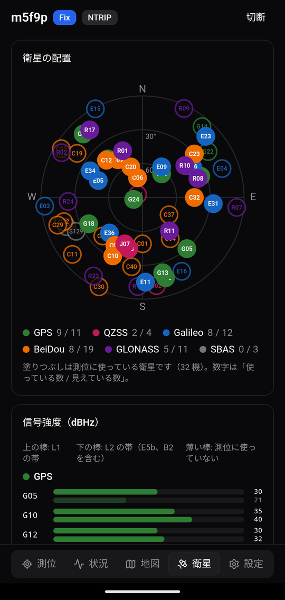

衛星の配置(スカイプロット)の下に、衛星ごとの信号強度が続きます。表示だけで、ほかの画面には移りません。

## 設定

| | |
|---|---|
| 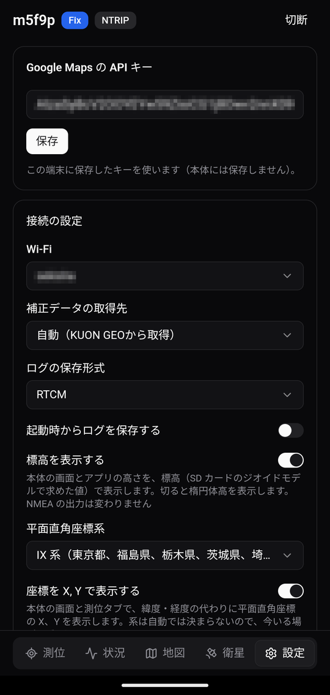 | 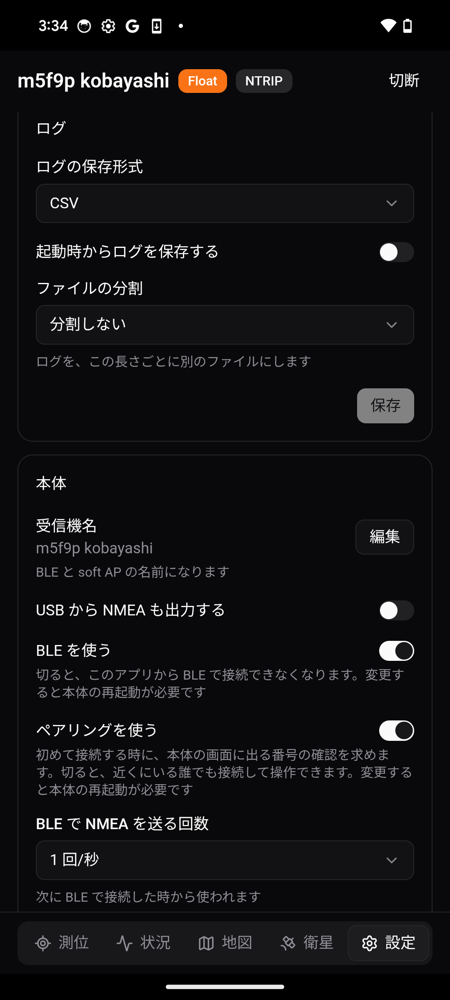 |

表示、接続の設定、ログ、本体、IMU(実験的)、Google Maps の API キーの枠が縦に並びます。項目と操作は Windows アプリと同じです([Windows アプリの画面](screens-windows.md#設定))。

起動時の設定(使う Wi-Fi と取得先、保存形式など。座標の形は測位タブ)は、変えた時点で本体に反映します。設定ファイルの項目は、変えると枠の `保存` が押せるようになります。`本体を再起動` を押すと確認が出て、`実行` で再起動します。

### Wi-Fi と補正データの取得先の一覧

| | |
|---|---|
| 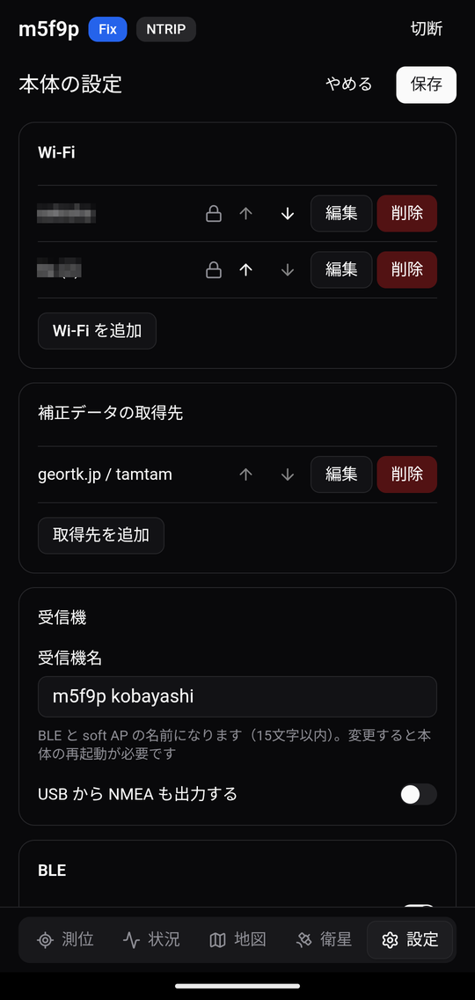 | 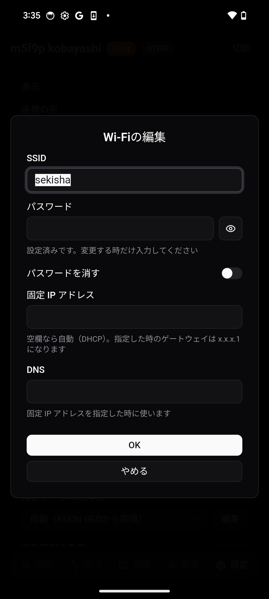 |

Wi-Fi や補正データの取得先の `編集` を押すと、登録の一覧のダイアログが開きます(左の画像)。一覧の `編集` や追加を押すと、その項目の入力画面が重なって開きます(右の画像は Wi-Fi)。`OK` で一覧に反映し、本体に書き込むのは一覧の `保存` を押したときです。
