# 本体の画面

M5Stack CoreS3 の液晶(320×240、タッチ)に出る画面と、その移り方です。表示は英語です。

画像は、本体から取り出した描画内容です(`mise run lcd-shot`)。Wi-Fi の SSID、IP アドレス、MAC アドレス、BLE のアドレスはモザイクにしています。

## 画面遷移

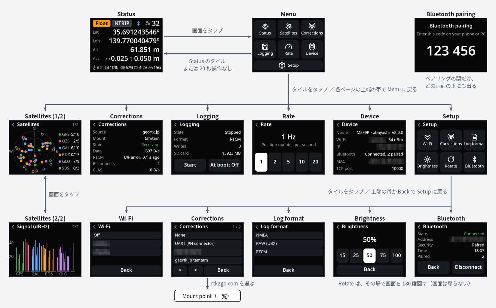

- Menu から開いたページ(Satellites、Corrections、Logging、Rate、Device、Setup)は、上端の帯(`‹ 題名`)をタップすると Menu に戻ります。
- Setup から開いた画面は、上端の帯と、下の `Back` ボタンのどちらでも Setup に戻ります。
- Bluetooth pairing は、ペアリングの間だけ、どの画面の上にも出ます。

## Status

起動すると、この画面が出ます。画面のどこをタップしても Menu に移ります。

| | |
|---|---|
| 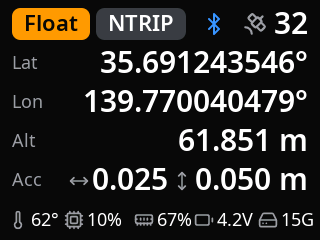 | 1段目は、測位の状態(`Fix` / `Float` / `DGPS` / `Single` / `No fix`)、補正の方法(`NTRIP` / `TCP` / `UART` / `CLAS` / `None`)、衛星数です。BLE の相手が接続している間は Bluetooth のアイコン、ログの保存中は点滅する赤い丸と `REC` が、その間に出ます。 続いて、緯度(Lat)、経度(Lon)、楕円体高(Alt)、推定精度(Acc。左右の矢印が水平、上下の矢印が垂直)。 最下段は本体の状態で、左から CPU 温度、CPU 使用率、メモリ使用率、電圧、SD カードの空きです。 |

## Menu

| | |
|---|---|
| 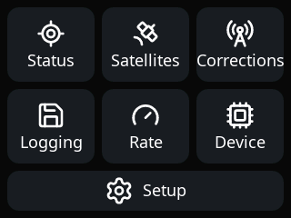 | タイルをタップして、各ページに移ります。20 秒操作しないと Status に戻ります。 |

## Menu から開くページ

| 画面 | 内容と操作 |
|---|---|
| 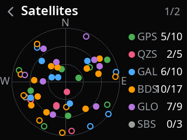 | **Satellites(1/2)** 衛星の配置(スカイプロット)と、衛星系ごとの「使っている数 / 見えている数」。画面をタップすると、信号強度に切り替わります。 |
| 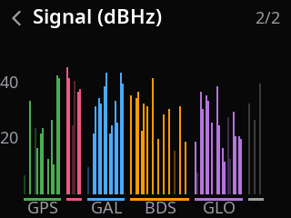 | **Satellites(2/2)** 衛星ごとの信号強度(dBHz)。画面をタップすると、配置に戻ります。 |
| 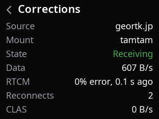 | **Corrections** 補正データの取得先、状態、受信量、RTCM のエラー率、再接続の回数、CLAS の受信量。表示だけです。 |
| 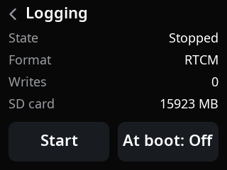 | **Logging** ログ保存の状態、形式、書き込み回数、SD カードの容量。`Start` / `Stop` で保存を始める・止める、`At boot` で起動時から保存するかどうかを切り替えます。 |
| 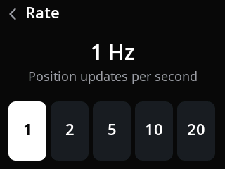 | **Rate** 測位レート。1 / 2 / 5 / 10 / 20 Hz から選びます。すぐに反映します。 |
| 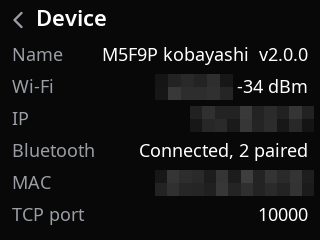 | **Device** 受信機名とバージョン、Wi-Fi、IP アドレス、Bluetooth、MAC アドレス、TCP サーバのポート。異常があるときは、ここに赤い字で警告が出ます。表示だけです。 |

## Setup

| | |
|---|---|
| 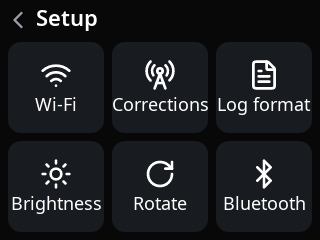 | 設定の項目をタイルで並べています。タップすると、その項目の画面が開きます。どの項目も、変更はすぐに反映します(再起動しません)。 `Rotate` は、タップするたびに画面を 180 度回します(画面は移りません)。 測位データの送信先(`client.ip`)を設定ファイルに書いているときは、`TCP: On` / `TCP: Off` のタイルが加わり、タップで送信を入・切します。 |

初めて起動したとき(保存した設定がないとき)は、Status ではなく Setup から始まります。

### Setup から開く画面

どの画面も、上端の帯か `Back` で、何も変えずに Setup に戻れます。

| 画面 | 内容と操作 |
|---|---|
| 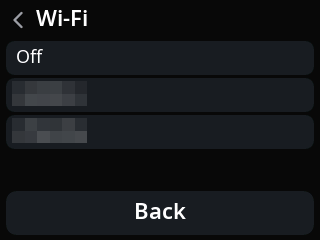 | **Wi-Fi** 設定ファイルに登録してある接続先の一覧。行をタップすると、その Wi-Fi につなぎ替えて Setup に戻ります。`Off` は Wi-Fi を使いません。1件も登録していないときは、その旨の案内が出ます。 |
| 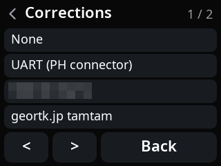 | **Corrections** 補正データの取得先の一覧。`None`(使わない)、`UART (PH connector)`、設定ファイルに登録した取得先が並びます。Wi-Fi につながっているときは、最後に rtk2go.com のマウントポイントを選ぶ項目が加わります(一覧が1画面に収まらないときは、下の `<` `>` でページを送ります)。 |
| 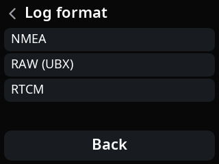 | **Log format** ログの保存形式。`NMEA`(設定によっては `CSV`)、`RAW (UBX)`、`RTCM` から選びます。保存中に変えると、新しい形式で保存し直します。 |
| 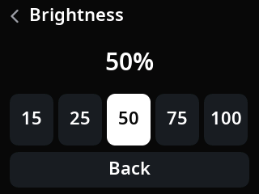 | **Brightness** 画面の明るさ。15 / 25 / 50 / 75 / 100 % から選びます。 |
| 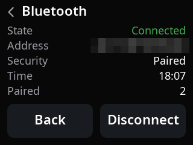 | **Bluetooth** 接続している相手の情報(アドレス、ペアリングの状態、接続してからの時間)と、ペアリングを覚えている数。`Disconnect` で相手を切断します(ペアリングは消えないので、相手はあとでつなぎ直せます)。接続していないときは `State` が `Waiting` になり、`Disconnect` は押せません。 |

rtk2go.com の項目を選ぶと、現在地に近い順のマウントポイントの一覧(**Mount point**)が出ます。操作はほかの一覧と同じです。この画面の画像は載せていません。

## Bluetooth pairing

| | |
|---|---|
| 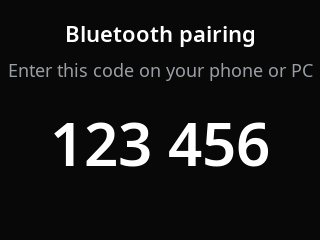 | 初めての相手が BLE で接続すると、6桁の番号が出ます。相手(スマートフォン、PC)でこの番号を入力すると、ペアリングが済んで元の画面に戻ります。この間、タッチの操作は受け付けません。 |
