# Windows アプリの画面

Windows アプリ(Electron)の画面と、その移り方です。画面そのものは Android アプリと共通で(`web/`)、ウィンドウが広いぶん、項目が横に並びます。

画像は、本体を USB で接続して撮ったものです(`mise run win-shot`)。Wi-Fi の SSID、IP アドレス、API キーはモザイクにしています。

## 画面遷移

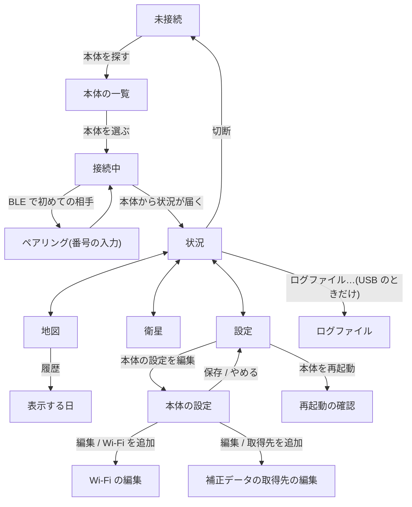

- 状況、地図、衛星、設定は、下端のタブで行き来します。タブは、接続している間だけ出ます。
- 右上の `切断` は、どのタブからでも押せます。切断すると、未接続の画面に戻ります。
- 本体の画面(Setup → Bluetooth → Disconnect)から切断されたときも、未接続の画面に戻ります。

## 接続

| 画面 | 内容と操作 |
|---|---|
| 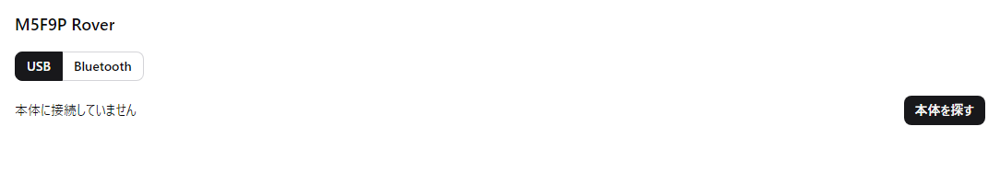 | **未接続** 起動すると、この画面が出ます。接続の方法(`USB` / `Bluetooth`)を選び、`本体を探す` を押します。 |
| 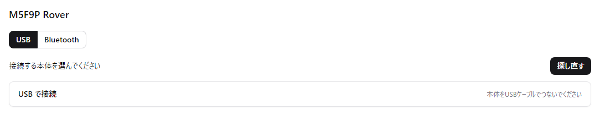 | **本体の一覧(USB)** `USB で接続` を押すと、USB ケーブルでつないだ本体に接続します。ポートを選ぶ画面は出ません(アプリが本体を見つけます)。 |
| 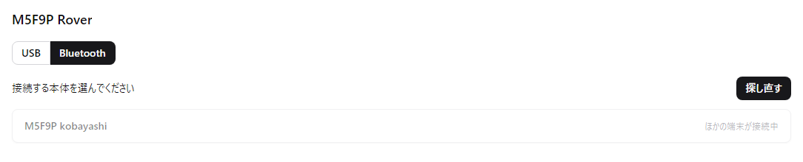 | **本体の一覧(Bluetooth)** 見つかった本体が並びます。本体を押すと接続します。ほかの端末(Android アプリなど)が接続している本体は、`ほかの端末が接続中` と出て、選べません。 |

本体を選ぶと「接続しています…」「本体からの状況を待っています…」と出て、状況が届くと「状況」のタブに移ります。

BLE で初めて接続するときは、本体の画面に6桁の番号が出て、アプリに「ペアリング」の入力画面が出ます。番号を入力すると、接続が続きます。一度ペアリングすれば、次からは出ません。この画面の画像は載せていません(撮るには、ペアリングの解除が必要なため)。

## 状況

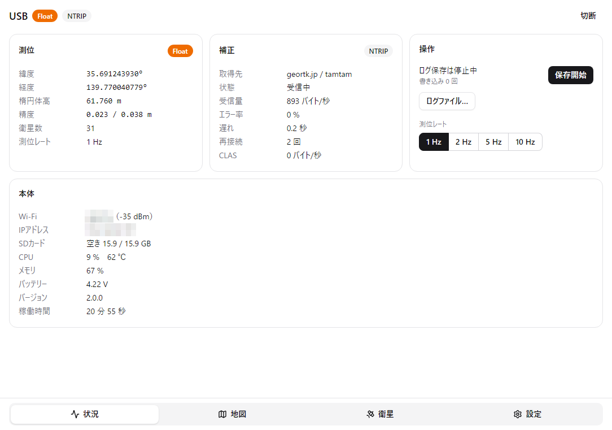

上端に、接続の名前(USB のときは `USB`、BLE のときは受信機名)、測位の状態、補正の方法が出ます。

| 枠 | 内容と操作 |
|---|---|
| 測位 | 緯度、経度、楕円体高、精度(水平 / 垂直)、衛星数、測位レート |
| 補正 | 取得先、状態、受信量、エラー率、遅れ、再接続の回数、CLAS の受信量 |
| 操作 | `保存開始` / `保存停止`(ログの保存)、`ログファイル…`、測位レートの切り替え(1 / 2 / 5 / 10 Hz) |
| 本体 | Wi-Fi、IP アドレス、SD カードの空き、CPU の使用率と温度、メモリ、バッテリー、バージョン、稼働時間 |

### ログファイル

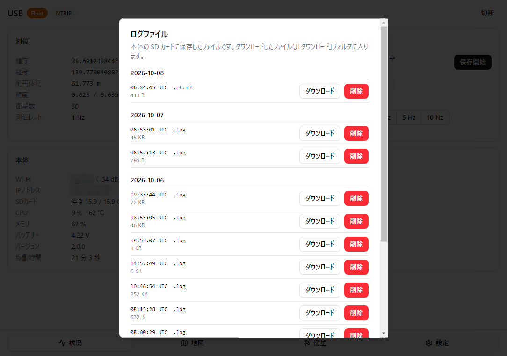

`ログファイル…` を押すと開きます。本体の SD カードにあるログを、日付ごとに並べます。`ダウンロード` で PC の「ダウンロード」フォルダに保存し、`削除` で本体から消します(消す前に確認が出ます)。`閉じる` で状況に戻ります。

USB で接続しているときだけ使えます。BLE のときは、ボタンが押せません。

## 地図

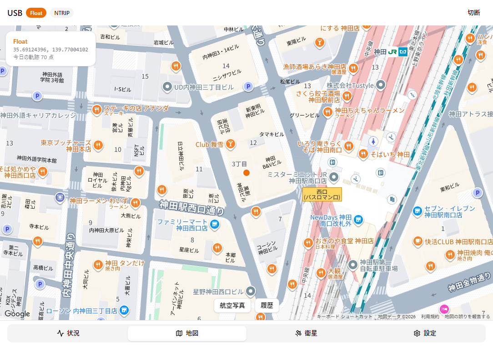

現在地と、今日の軌跡を表示します。左上に、測位の状態、座標、軌跡の点数が出ます。

- `航空写真` / `地図`: 地図の種類を切り替えます。
- `現在地`: 地図を動かしたあとに出ます。押すと、現在地の追従に戻ります。
- `履歴`: 「表示する日」を開きます。

Google Maps の API キーを設定していないときは、左上にその旨が出ます(「設定」のタブで入力します)。

### 表示する日

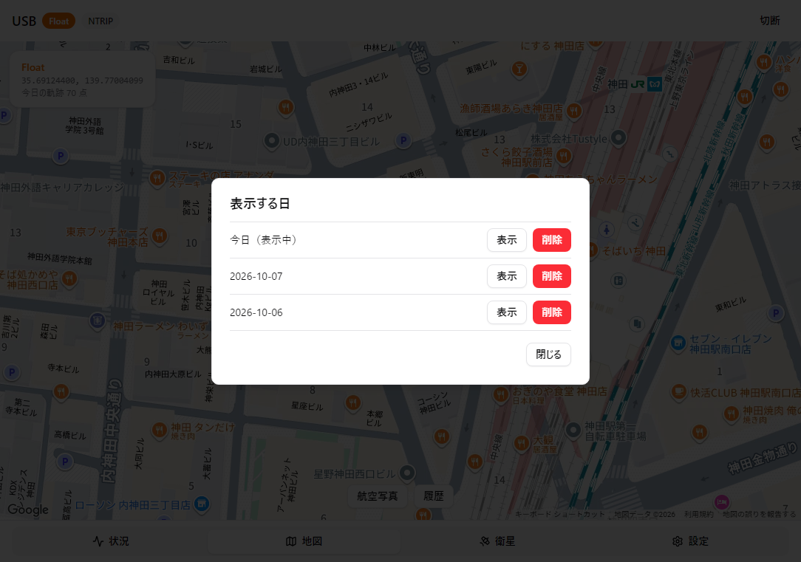

軌跡が残っている日の一覧です。`表示` でその日の軌跡を地図に出し、`削除` でその日の軌跡を消します。`閉じる` で地図に戻ります。

## 衛星

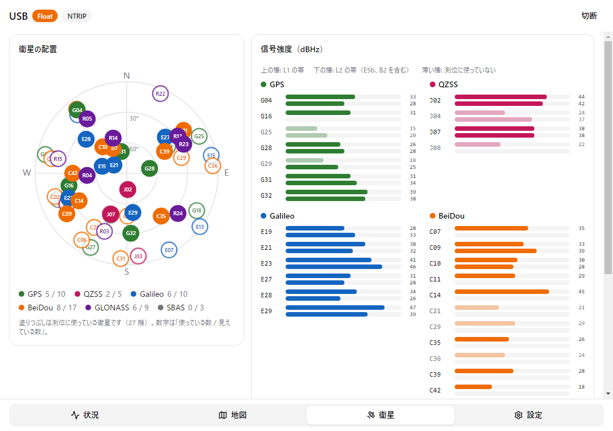

左は衛星の配置(スカイプロット)、右は衛星ごとの信号強度(上の帯が L1 の帯、下の帯が L2 の帯)です。塗りつぶした印と濃い帯が、測位に使っている衛星と信号です。表示だけで、ほかの画面には移りません。

このタブを開いている間だけ、本体に衛星の情報を問い合わせます。

## 設定

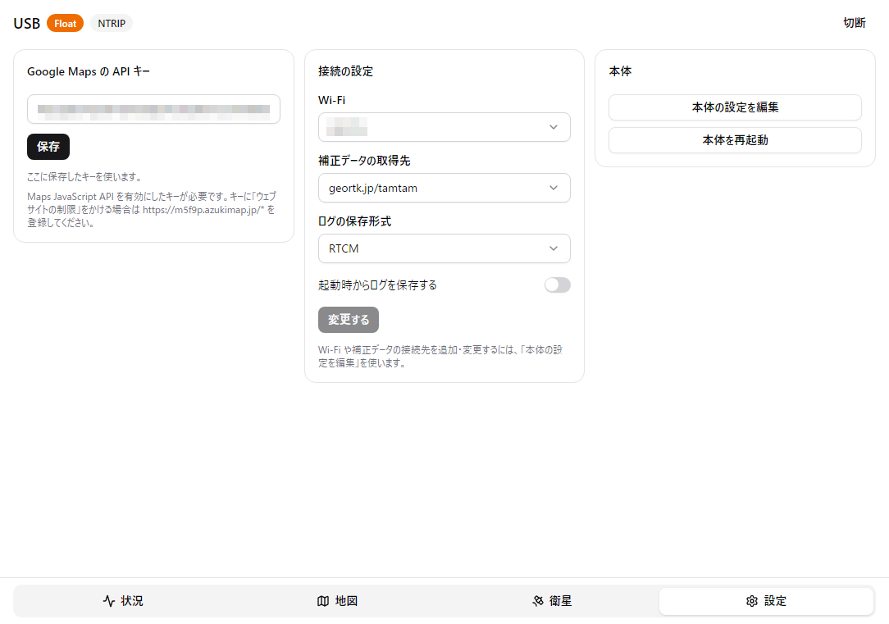

| 枠 | 内容と操作 |
|---|---|
| Google Maps の API キー | 地図に使うキーを入力して `保存`。この PC に保存されます |
| 接続の設定 | 使う Wi-Fi、補正データの取得先、ログの保存形式、起動時からログを保存するかどうか。`変更する` で本体にすぐ反映します(再起動しません) |
| 本体 | `本体の設定を編集`、`本体を再起動` |

### 本体の設定

`本体の設定を編集` を押すと、設定のタブの中身が、本体の設定ファイルの編集画面に替わります。

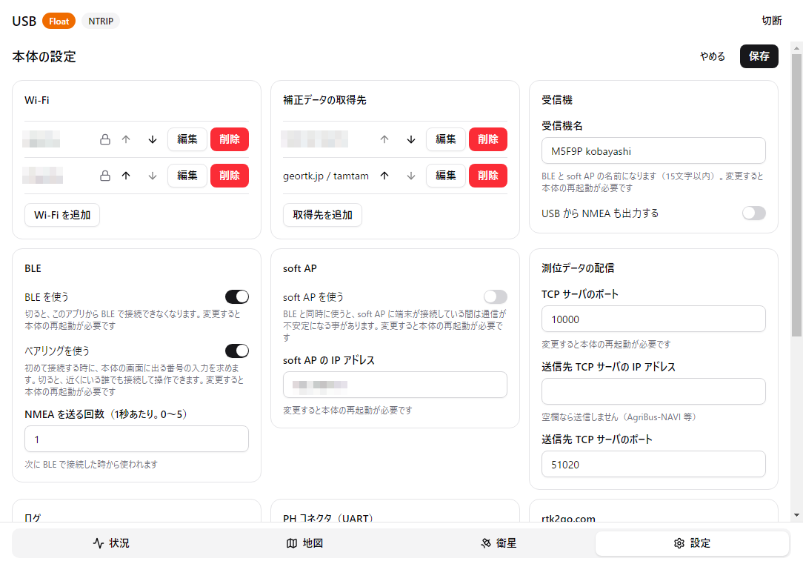

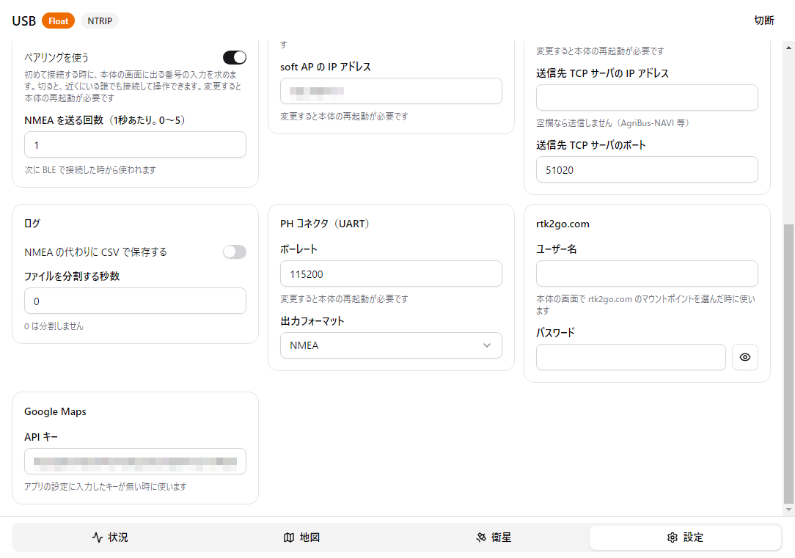

Wi-Fi と補正データの取得先は一覧で、`編集`、`削除`、並べ替え(↑↓)、追加ができます。そのほか、受信機名、BLE、soft AP、測位データの配信、ログ、PH コネクタ、rtk2go.com、Google Maps の項目があります。

- `保存`: 確認のあと、本体に書き込みます。ほとんどの項目はすぐに反映します。再起動が要る項目(受信機名、BLE、soft AP など)を変えたときは、再起動するかどうかを尋ねます。
- `やめる`: 設定のタブに戻ります。変更があるときは、捨ててよいかを尋ねます。

パスワードは本体から読み出しません。登録済みの項目には鍵の印が付き、入力欄は空のまま出ます(変えるときだけ入力します)。

| 画面 | 内容と操作 |
|---|---|
| 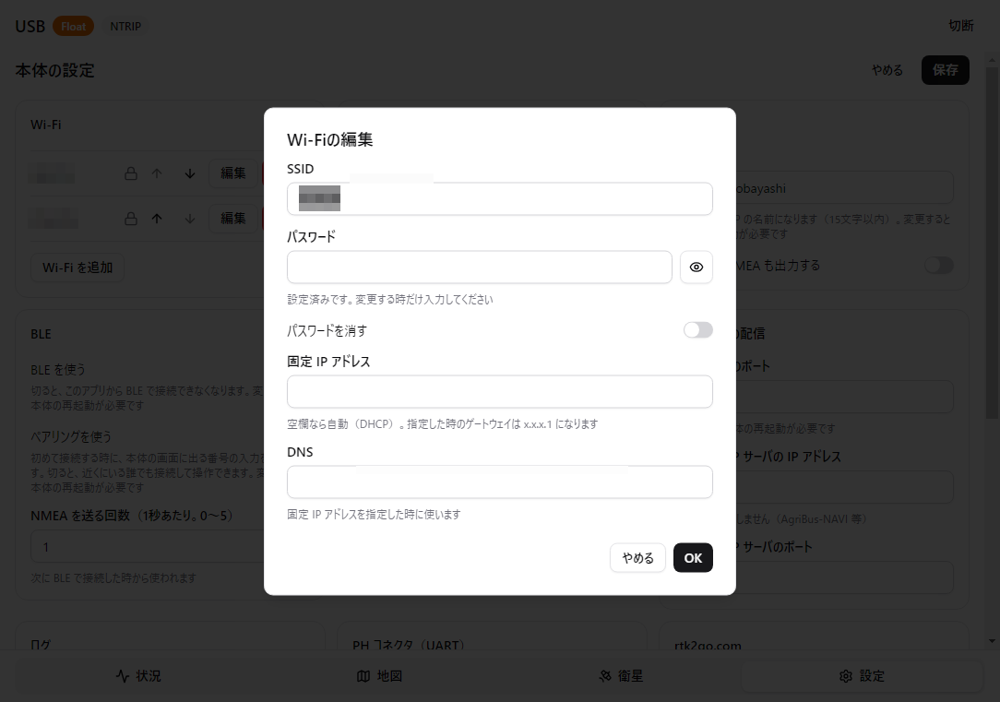 | **Wi-Fi の編集** SSID、パスワード、固定 IP アドレス、DNS。`OK` で一覧に反映し(本体への書き込みは `保存` を押したとき)、`やめる` で閉じます。 |
| 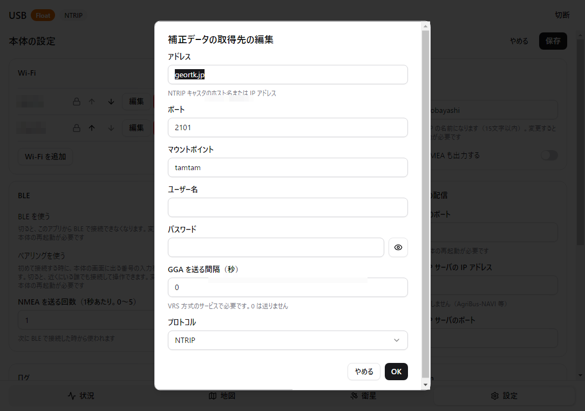 | **補正データの取得先の編集** アドレス、ポート、マウントポイント、ユーザー名、パスワード、GGA を送る間隔、プロトコル。操作は Wi-Fi の編集と同じです。 |

### 再起動の確認

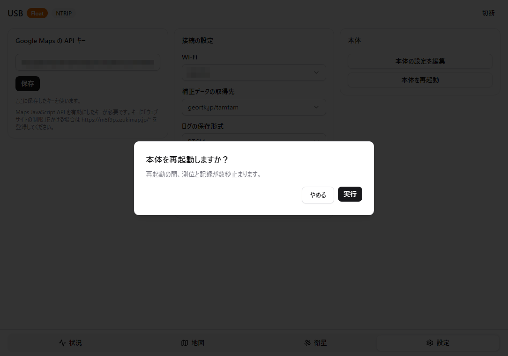

`本体を再起動` を押すと出ます。`実行` で本体が再起動し、`やめる` で設定に戻ります。
